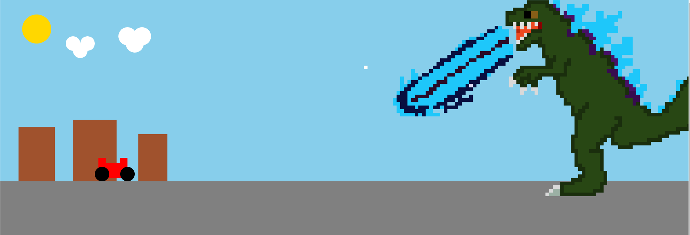

# Atividade-Canvas
Céu
O céu foi feito usando um retângulo de cor azul claro, utilizando a função fillRect(x, y, width, height) para desenhar o retângulo.

Sol
O sol foi feito usando um círculo amarelo utilizando a função arc(x, y, radius, startAngle, endAngle) para desenhar o círculo.

Nuvens
As nuvens foram feitas usando a função arc(x, y, radius, startAngle, endAngle). Foram desenhados vários círculos brancos para formar as nuvens.

Rua
A rua foi feita usando um retângulo cinza utilizando a função fillRect(x, y, width, height) para desenhar o retângulo.

Prédios
Os prédios foram feitos usando retângulos marrons utilizando a função fillRect(x, y, width, height) para desenhar os retângulos.

Carro
O carro foi feito usando retângulos vermelhos e pretos. A carroceria do carro foi feita utilizando a função fillRect(x, y, width, height), e as rodas foram feitas utilizando a função arc(x, y, radius, startAngle, endAngle).

